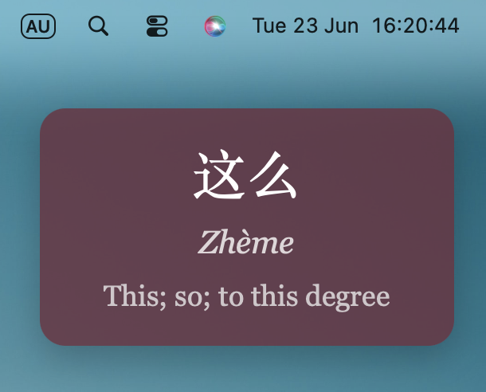

# Rotating Chinese Flashcard Widget

A custom [Übersicht](http://tracesof.net/uebersicht/) desktop widget that displays random Chinese vocabulary flashcards with Chinese characters, pinyin, and English translation. The flashcard changes every **1 hour**.

The widget is designed for Chinese learners who want passive vocabulary exposure directly on their Mac desktop.

The included `phrases.txt` file currently contains **HSK 3 vocabulary**.

## Features

* Displays one random Chinese flashcard at a time
* Shows Chinese characters, pinyin, and English translation
* Uses a simple editable `phrases.txt` file
* Can be customised by changing colours, font, size, position, and styling in the code
* Slightly transparent design, so desktop files behind the widget remain partly visible

## Preview

The widget displays one random vocabulary card at a time.

Add a screenshot of your widget here:

```markdown

```

## Phrase Format

Each line in `phrases.txt` should use this format:

```text
Chinese|Pinyin|English
```

Example:

```text
慢慢来|Màn màn lái|Take it slowly.
今天也要加油|Jīntiān yě yào jiāyóu|Keep going today too.
我可以做到|Wǒ kěyǐ zuòdào|I can do it.
```

Do **not** add commas or extra symbols between the sections.
The widget uses the `|` symbol to separate Chinese, pinyin, and English.

## Editing the Phrases

You can modify the phrases shown by the widget by editing the `phrases.txt` file.

Each line should contain one flashcard entry.

Example:

```text
你好|nǐ hǎo|hello
谢谢|xièxie|thank you
我喜欢学习中文|wǒ xǐhuān xuéxí zhōngwén|I like studying Chinese
```

You can replace the existing HSK 3 vocabulary with your own Chinese vocabulary, example sentences, grammar notes, or study content.

Although this widget was designed for Chinese study, you can use it for any language or topic by editing `phrases.txt`.

## Customisation

You can customise the appearance of the widget by editing `index.jsx`.

Open:

```text
rotating-phrases.widget/index.jsx
```

In the code, you can change things such as:

* background colour
* text colour
* font size
* font family
* widget size
* transparency
* border radius
* position on the screen

For example, you can edit values such as:

```css
background: rgba(255, 255, 255, 0.75);
color: #000;
font-size: 18px;
border-radius: 16px;
padding: 16px;
```

### Changing the Colour

To change the background colour, look for the `background` value.

Example dark background:

```css
background: rgba(0, 0, 0, 0.75);
```

Example light background:

```css
background: rgba(255, 255, 255, 0.75);
```

Example soft pink background:

```css
background: rgba(255, 220, 235, 0.85);
```

### Changing the Text Colour

Look for the `color` value.

Example white text:

```css
color: #ffffff;
```

Example black text:

```css
color: #000000;
```

### Changing the Size

To make the widget larger or smaller, edit values such as:

```css
font-size: 18px;
padding: 16px;
```

For a larger widget:

```css
font-size: 22px;
padding: 24px;
```

For a smaller widget:

```css
font-size: 14px;
padding: 10px;
```

### Changing the Position

To move the widget, edit its position values in `index.jsx`.

For example:

```css
top: 20px;
right: 20px;
```

To move it further down:

```css
top: 80px;
right: 20px;
```

To place it on the left side instead:

```css
top: 20px;
left: 20px;
```

If you use `left`, remove or comment out `right`.

## Troubleshooting

### The widget is not showing anything

Check that:

* `phrases.txt` exists inside the `rotating-phrases.widget` folder
* `index.jsx` is inside the same widget folder
* the widget folder is inside the Übersicht widgets folder
* Übersicht has been refreshed

Your widget folder should be located here:

```text
~/Library/Application Support/Übersicht/widgets/
```

### The widget says the file cannot be found

This usually means the path to `phrases.txt` is incorrect.

Open:

```text
rotating-phrases.widget/index.jsx
```

Find the phrase file path. It may look like this:

```js
const phraseFilePath = '/Users/YOUR-USERNAME/Library/Application Support/Übersicht/widgets/rotating-phrases.widget/phrases.txt'
```

Replace `YOUR-USERNAME` with your Mac username.

Example:

```js
const phraseFilePath = '/Users/ella/Library/Application Support/Übersicht/widgets/rotating-phrases.widget/phrases.txt'
```

To find your Mac username, open Terminal and type:

```bash
whoami
```

Then use the result in the file path.

### My phrases are not updating

After editing `phrases.txt`, refresh Übersicht.

You can do this by clicking the Übersicht icon in the menu bar and selecting refresh, or by quitting and reopening Übersicht.

### The widget appears in the wrong place

Edit the position values in `index.jsx`, such as:

```css
top: 20px;
right: 20px;
```

Adjust the numbers until the widget appears where you want it.

## Notes

The included phrase list currently contains **HSK 3 Chinese vocabulary**, but you can fully replace it with your own words or sentences.

The widget is slightly transparent by design, so files or wallpaper behind it may remain visible.
